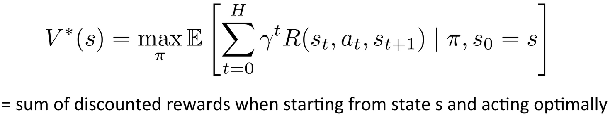
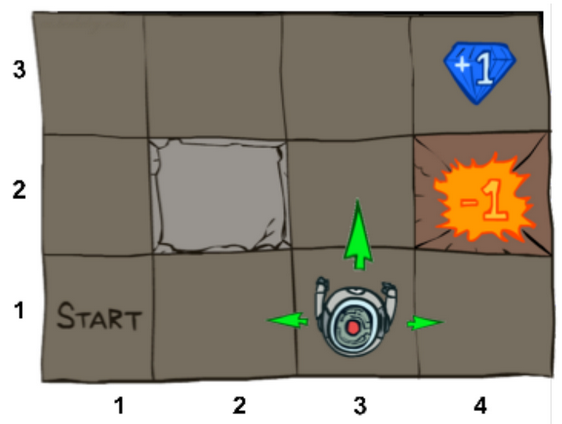

# Value Iteration Method - Reinforcement Learning
Value Iteration is an exact method of solving a Reinforcement Learning problem. The goal of the task is to find how much expected discounted reward we can get from *s* if we use the best possible policy.

In mathmetical notations, we calculate this(below equation) for every state in set of States *S*, given an MDP.

||
|:---------------------------------:|
|*[Src: UC Berkley 2017 Deep RL bootcamp Lecture 1 slides](https://drive.google.com/file/d/0BxXI_RttTZAhVXBlMUVkQ1BVVDQ/view)*|

## Task at Hand
The task is to maximize a reward in a world that consists of an agent that can navigate in 4 directions - North, South, East and West. With a 20% of equally likely chance of deviating to left or right from the action asked to perform.

||
|:--------------------------:|
|*[Src: UC Berkley 2017 Deep RL bootcamp Lecture 1 slides](https://drive.google.com/file/d/0BxXI_RttTZAhVXBlMUVkQ1BVVDQ/view)*|

## Usage
Modify `main.json` to suit your needs. The key names are self explanatory. Then run `python main.py`.

You can also create your own `<user-defined>.json` file with every paramter defined and then run `python main.py --json_path <user-defined>.json`
